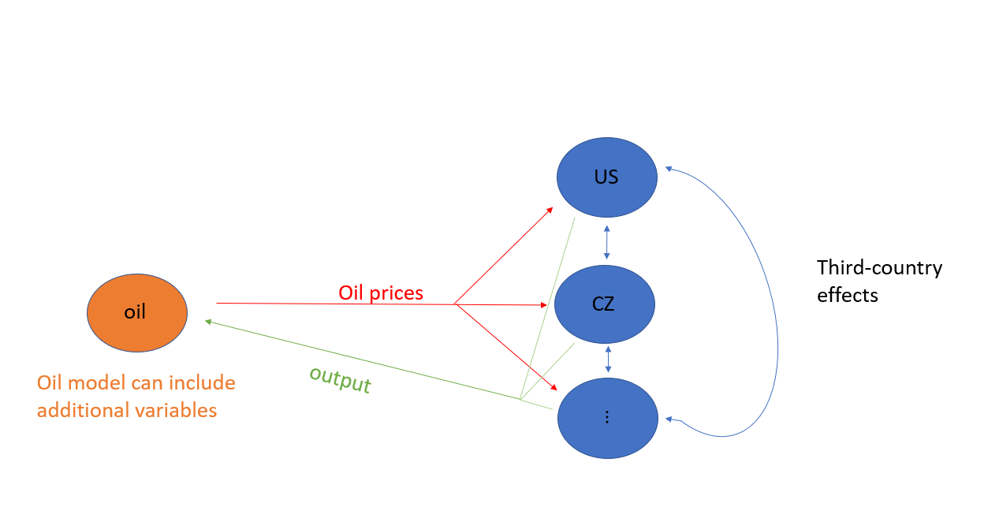
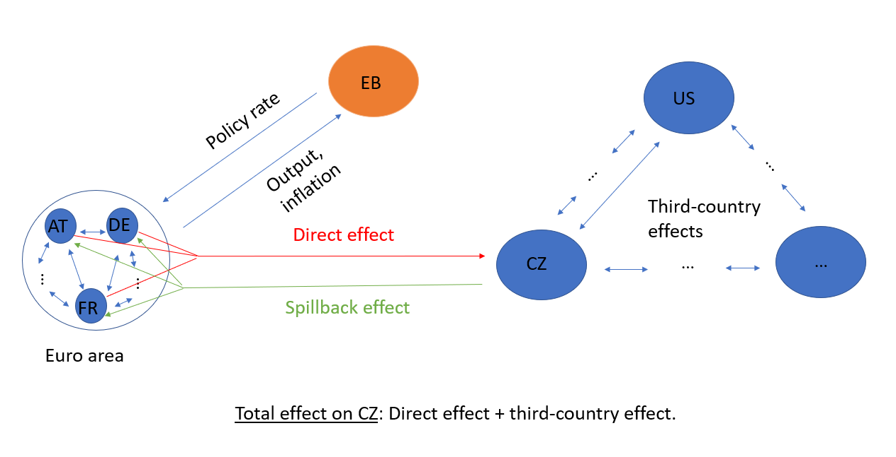

```{r, include=FALSE}
knitr::opts_chunk$set(fig.width = 12, fig.height=8, fig.align="default")
knitr::opts_chunk$set(error = TRUE)
```


\section{Introduction}
# Introduction
<p align=justify>
This vignette describes the BGVAR package that allows to estimate Bayesian global vector autoregressions (GVARs). The focus of the vignette is to provide a range of examples that demonstrate the full functionality of the library. It is accompanied by a more technical description of the GVAR framework. Here, it suffices to briefly summarize the main idea of a GVAR, which is a large system of equations designed to analyze or control for interactions across units. Most often, these units refer to countries and the interactions between them arise through economic and financial interdependencies. Also in this document, the examples we provide contain cross-country data. In principle, however, the GVAR framework can be applied to other units, such as regions, firms, etc. The following examples show how the GVAR can be used to either estimate spillover effects from one country to another, or alternatively, to look at the effects of a domestic shock controlling for global factors.  
</p>

<p align=justify>
In a nutshell, the GVAR consists of two stages. In the first, $N$ vector autoregressive (VAR) models are estimated, one per unit. Each equation in a unit model is augmented with foreign variables, that control for global factors and allow to link the unit-specific models later. Typically, these foreign variables are constructed using exogenous, bilateral weights, stored in an $N \times N$ weight matrix. The classical framework of @Pesaran2004 and @Dees2007a  proposes estimating these country models in vector error correction form, while in this package we take a Bayesian stance and estimation is carried out using VARs. The user can transform the data prior estimation into stationary form or estimate the model in levels. The `BGVAR` package also allows to include a trend to get trend-stationary data. In the second step, the single country models are combined using the assumption that single models are linked via the exogenous weights, to yield a global representation of the model. This representation of the model is then used to carry out impulse response analysis and forecasting.
</p>


<p align=justify>
This vignette consists of four blocks: getting started and data handling, estimation, structural analysis and forecasting. In the next part, we discuss which data formats the `bgvar` library can handle. We then proceed by showing examples of how to estimate a model using different Bayesian shrinkage priors -- for references see @CrespoCuaresma2016 and @Feldkircher2016a. We also discuss how to run diagnostic and convergence checks and examine the main properties of the model. In the third section, we turn to structural analysis, either using recursive (Cholesky) identification or sign restrictions. We will also discuss structural and generalized forecast error variance decompositions and historical decompositions. In the last section, we show how to compute unconditional and conditional forecasts with the package.
</p>


\section{Getting started}
# Getting started

We start by installing the package from CRAN and attaching it with 

```{r,hide=TRUE}
oldpar <- par(no.readonly=TRUE)
set.seed(1)
library(BGVAR)
```
<p align=justify>
To ensure reproducibility of the examples that follow, we have set a particular seed (for `R`s random number generator). As every `R` library, the `BGVAR` package provides built-in help files which can be accessed by typing `?` followed by the function / command of interest. It also comes along with four example data sets, two of them correspond to data the quarterly data set used in @Feldkircher2016a (`eerData`, `eerDataspf`), one is on monthly frequency (`monthlyData`). For convenience we also include the data that come along with the Matlab GVAR toolbox of @matlabToolbox, `pesaranData`. We include the 2016 vintage [@Mohaddes2018]. </p>

<p align=justify>
We start illustrating the functionality of the `BGVAR` package by using the `eerData` data set from @Feldkircher2016a. It contains 76 quarterly observations for 43 countries and the period from 1995Q1 to 2013Q4. The euro area (EA) is included as a regional aggregate. 
</p>

We can load the data by typing
```{r "eerData"}
data(eerData)
```
 
<p align=justify>
 This loads two objects: `eerData`, which is a list object of length $N$ (i.e., the number of countries) and `W.trade0012`, which is an $N \times N$ weight matrix. 
</p>

We can have a look at the names of the countries contained in `eerData` 
```{r "eerData2"}
names(eerData)
```

and at the names of the variables contained in a particular country by
```{r "eerData3"}
colnames(eerData$UK)
```

We can zoom in into each country by accessing the respective slot of the data list:
```{r "US",echo=TRUE}
head(eerData$US)
```

<p align=justify>
Here, we see that the global variable, oil prices (`poil`) is attached to the US country model. This corresponds to the classical GVAR set-up used among others in @Pesaran2004 and @Dees2007a. We also see that in general, each country model $i$ can contain a different set of variables $k_i$ as opposed to requirements in a balanced panel. 
</p>


<p align=justify>
The GVAR toolbox relies on one important *naming convention*, though: It is assumed that neither the country names nor the variable names contain a `.` The reason is that the program internally has to collect and separate the data more than once and in doing that, it uses the `.` to separate countries / entities from variables. To give a concrete example, the slot in the `eerData` list referring to the USA should not be labelled `U.S.A.`, nor should any of the variable names contain a `.`
</p>

<p align=justify>
The toolbox also allows the user to submit the data as a $T \times k$ data matrix, with $k=\sum^N_{i=1} k_i$ denoting the sum of endogenous variables in the system. We can switch from data representation in list form to matrix from by using the function `list_to_matrix` (and vice versa using `matrix_to_list`). 
</p>

To convert the `eerData` we can type: 


```{r "convert",echo=TRUE}
bigX<-list_to_matrix(eerData)
```
<p align=justify>
For users who want to submit data in matrix form, the above mentioned naming convention implies that the column names of the data matrix have to include the name of the country / entity and the variable name, separated by a `.` For example, for the converted `eerData` data set, the column names look like:
</p>

```{r "convert2",echo=TRUE}
colnames(bigX)[1:10]
```

<p align=justify>
In both cases, submitting data as list or as big matrix, the underlying data can be either of `matrix` class or time series classes such as `ts` or `xts`.   
</p>


<p align=justify>
Finally, we look at the second important ingredient to build our GVAR model, the weight matrix. Here, we use annual bilateral trade flows (including services), averaged over the period from 2000 to 2012. This implies that The $ij^{th}$ element of $W$ contains trade flows from unit $i$ to unit $j$. These weights can also be made symmetric by calculating $\frac{(W_{ij}+W_{ji})}{2}$. Using trade weights to establish the links in the GVAR goes back to the early GVAR literature [@Pesaran2004] but is still used in the bulk of GVAR studies. Other weights, such as financial flows, have been proposed in @Eickmeier2015 and examined in @Feldkircher2016a. Another approach is to use estimated weights as in @Feldkircher2019b. The weight matrix should have `rownames` and `colnames` that correspond to the $N$ country names contained in `Data`.  
</p>

```{r "tradeW",echo=TRUE}
head(W.trade0012)
```


The countries in the weight matrix should be in the same order as in the data list:
```{r "rownames.W"}
all(colnames(W.trade0012)==names(eerData))
```

The weight matrix should be row-standardized and the diagonal elements should be zero:

```{r "rowSums.W"}
rowSums(W.trade0012)
diag(W.trade0012)
```

Note that through row-standardizing, the final matrix is typically not symmetric (even when using the symmetric weights as raw input). 

<p align=justify>
In what follows, we restrict the dataset to contain only three countries, `EA`, `US` and `RU` and adjust the weight matrix accordingly. We do this only for *illustrational purposes to save time and storage in this document*: 
</p>


```{r, "eerDatasmall", hide=TRUE}
cN<-c("EA","US","RU")
eerData<-eerData[cN]
W.trade0012<-W.trade0012[cN,cN]
W.trade0012<-apply(W.trade0012,2,function(x)x/rowSums(W.trade0012))
W.list<-lapply(W.list,function(l){l<-apply(l[cN,cN],2,function(x)x/rowSums(l[cN,cN]))})
```

\section{Estimation}
# Estimation
<p align=justify>
The main function of the `BGVAR` package is its `bgvar` function. The unique feature of this toolbox is that we use Bayesian shrinkage priors with optionally stochastic volatility to estimate the country models in the GVAR. In its current version, three priors for the country VARs are implemented:
</p>

* Non-conjugate Minnesota prior [`MN`, @Litterman1986;@Koop2010]
* Stochastic Search Variable Selection prior [`SSVS`, @George2008]
* Normal-Gamma prior [`NG`, @Huber2019]

<p align=justify>
The first two priors are described in more detail in @CrespoCuaresma2016. For a more technical description of the Normal-Gamma prior see @Huber2019 and for an application in the GVAR context @Feldkircher2019b. For the variances we can assume homoskedasticity or time variation (stochastic volatility). For the latter, the library relies on the `stochvol` package of @Kastner2016.
</p>
We start with estimating our toy model using the `NG` prior, the reduced `eerData` data set and 
the adjusted `W.trade0012` weight matrix:

```{r "model.1",results="hide"}
 model.1<-bgvar(Data=eerData,
                W=W.trade0012,
                draws=100,
                burnin=100,
                plag=1,
                prior="NG",
                hyperpara=NULL, 
                SV=TRUE,
                thin=1,
                trend=TRUE,
                h=0,
                save.country.store=FALSE,
                eigen=1.05
                )

```
<p align=justify>
The default prior specification in `bgvar` is to use the NG prior with stochastic volatility and one lag for both the endogenous and weakly exogenous variables (`plag=1`). In general, due to its high cross-sectional dimension, the GVAR can allow for very complex univariate dynamics and it might thus not be necessary to increase the lag length considerably as in a standard VAR [@Burriel2018].
</p>

<p align=justify>
The setting `hyperpara=NULL` implies that we use the standard hyperparameter specification for the NG prior; see the helpfiles for more details. The slots `draws` and `burnin` denote the posterior draws and the burn-in draws (i.e., the draws that are discarded). To ensure that the MCMC estimation has converged, a high-number of burn-ins is recommended (say 15,000 to 30,000). Saving the full set of posterior draws can eat up a lot of storage. To reduce this, we can use a thinning interval which stores only a thin$^{th}$ draw of the global posterior output. For example, with `thin=10` and `draws=5000` posterior draws, the amount of MCMC draws stored is 500. `TREND=TRUE` implies that the model is estimated using a trend. Note that regardless of the trend specification, each equation always automatically includes an intercept term.  To speed up computation, it is possible to set `cores` to the number of CPU cores to use.. The package then detects the used platform and either invokes `parLapply` (Windows platform) or `mclapply` (non-Windows platform). If `cores=NULL` then `lapply` is used. In case the user wants to specify its own apply function, this is also possible by passing it to the argument `applyfun`. Ideally the number of cores is equal to the number of units $N$. In addition to storing the global posterior, we could also be interested in inspecting the output of the $N$ country models in more detail. To do so, we could set `save.country.store=TRUE` allows to save the whole posterior distribution of the single country models, in the case we would like to inspect them. Due to storage reasons, the default is set to `FALSE` and only the posterior medians of the single country models are reported. Note that even in case `save.country.store=FALSE`, the whole posterior distribution of the \textit{global model} is reported.
</p>

<p align=justify>
With have estimated the above model with stochastic volatility (`SV=TRUE`). There are several reasons why one may want to let the residual variances change over time. First and foremost, most time periods used in macroeconometrics are nowadays rather volatile including severe recessions. Hence accounting for time variation might improve the fit of the model [@primiceri2005time; @sims2006were; @Dovern2016; @Huber2016].  Second, the specification implemented in the toolbox nests the homoskedastic case. It is thus a good choice to start with the more general case when first confronting the model with the data. For structural analysis such as the calculation of impulse responses, we take the variance covariance matrix with the median volatilities (over the sample period) on its diagonal.\footnote{Alternatively, one would have $T$ variance covariance matrices and hence $T$ impulse responses for each variable. Since the size of the shock (i.e., the residual variance) varies over time, the resulting impulses would be typically either up- or down-scaled, whereas the shapes of the IRFs are not affected.} If we want to look at the volatilities of the first equation (`y`) in the euro area country model, we can type:
</p>

```{r "SV",results="hide"}
model.1$cc.results$sig$EA[,"EA.y","EA.y"]
```


<p align=justify>
To discard explosive draws, we can compute the eigenvalues of the reduced form of the global model, written in its companion form. Unfortunately, this can only be done once the single models have been estimated and stacked together (and hence not directly built into the MCMC algorithm for the country models). To discard draws that lead to higher eigenvalues than 1.05 set `eigen=1.05`.  We can look at the 10 largest eigenvalues by typing: 
</p>

```{r "ng.eigen",echo=TRUE}
model.1$stacked.results$F.eigen[1:10]
```
Last, we have used the default option `h=0`, which implies that we use the full sample period to estimate the GVAR. For the purpose of forecast evaluation, `h` could be specified to a positive number, which then would imply that the last `h` observations are reserved as a hold-out sample and not used to estimate the model.


\subsection{Model output and diagnostic checks}
## Model output and diagnostic checks
<p align="justify">
Having estimated the model, we can have summarize the outcome in various ways.

First, we can use the `print` method 
</p>

```{r "print.model",echo=TRUE}
print(model.1)
```
<p align="justify">
This just prints the submitted arguments of the `bgvar` object along with the model specification for each unit. The asterisks indicate weakly exogenous variables, double asterisks exogenous variables and variables without asterisks the endogenous variables per unit.  
</p>

<p align="justify">
The `summary` method is a more enhanced way to analyze the output. It computes descriptive statistics like convergence properties of the MCMC chain, serial autocorrelation in the errors and the average pairwise autocorrelation of cross-unit residuals. 
</p>

```{r "summary.model"}
 summary(model.1)
```


<p align="justify">
We can now have a closer look at the information provided by `summary`. The header contains some basic information about the prior used to estimate the model, how many lags, posterior draws and countries. The next line shows Geweke's CD statistic, which is calculated  using the `coda` package. Geweke's CD  assesses practical convergence of the MCMC algorithm. In a nutshell, the  diagnostic is based on a test for equality of the means of the first and last part of a Markov chain (by default we use the first 10% and the last 50%). If the samples are drawn from the stationary distribution of the chain, the two means are equal and Geweke's statistic has an asymptotically standard normal distribution. 
</p>

<p align="justify">
The test statistic is a standard Z-score: the difference between the two sample means divided by its estimated standard error. The standard error is estimated from the spectral density at zero and so takes into account any autocorrelation. The test statistic shows that only a small fraction of all coefficients did not convergence. Increasing the number of burn ins can help decreasing this number further. The statistic can also be calculated by typing `conv.diag(model.1)`.
</p>


<p align="justify">
The next model statistic is the likelihood of the global model. This statistic can be used for model comparison. Next and to assess, whether there is first order serial autocorrelation present, we provide the results of a simple F-test. The table shows the share of p-values that fall into different significance categories. Since the null hypothesis is that of no serial correlation, we would like to have as many large ($>0.1$) p-values as possible. The statistics show that already with one lag, serial correlation is modest in most equations' residuals. This could be the case since we have estimated the unit models with stochastic volatility. To further decrease serial correlation in the errors, one could increase the number of lags via `plag`.
</p>

<p align="justify">
The last part of the summary output contains a statistic of cross-unit correlation of (posterior median) residuals. One assumption of the GVAR framework is that of negligible, cross-unit correlation of the residuals. Significant correlations prohibit structural and spillover analysis [@Dees2007a]. In this example, correlation is reasonably small.
</p>
 

<p align="justify">
Some other useful methods the `BGVAR` toolbox offers contain the `coef` (or `coefficients` as its alias) methods to extract the $k \times k \times plag$ matrix of reduced form coefficients of the global model. Via the `vcov` command, we can access the global variance covariance matrix and the `logLik()` function allows us to gather the global log likelihood (as provided by the `summary` command). 
</p>


```{r "stats",echo=TRUE, results="hide"}
Fmat <- coef(model.1)
Smat <- vcov(model.1)
lik  <- logLik(model.1)
```


<p align="justify">
Last, we can have a quick look at the in-sample fit using either the posterior median of the country models' residuals (`global=FALSE`) or those of the global solution of the GVAR (`global=TRUE`). The in-sample fit can also be extracted by using `fitted()`. 
</p>

Here, we show the in-sample fit of the euro area model (`global=FALSE`).
```{r "insample",fig.margin=TRUE,fig.width=6,fig.height=8,fig.cap="In-sample fit for euro area variables"}
yfit <- fitted(model.1)
plot(model.1, global=FALSE, resp="EA")
```


We can estimate the model with two further priors on the unit models, the SSVS prior and the Minnesota prior. To give a concrete example, the SSVS prior can be invoked by typing:
```{r "ssvs.1",echo=TRUE, results="hide"}
 model.ssvs.1<-bgvar(Data=eerData,
                     W=W.trade0012,
                     draws=100,
                     burnin=100,
                     plag=1,
                     prior="SSVS",
                     hyperpara=NULL, 
                     SV=TRUE,
                     thin=1,
                     trend=TRUE,
                     h=0,
                     save.country.store=FALSE,
                     eigen=1.05
                     )

```

<p align="justify">
One feature of the SSVS prior is that it allows to look at the posterior inclusion probabilities to gauge the importance of particular variables. For example, we can have a look at the PIPs of the euro area model by typing:
</p>

```{r "Pips"}
model.ssvs.1$cc.results$PIP$PIP.cc$EA
```

This prints in the columns, the equations in the EA country model and in the rows the included variables. 
The example shows that besides other variables, the trade balance (`tb`) is an important determinant of the real exchange rate (`rer`). 

We can also have a look at the average of the PIPs across all units:


```{r "pips.avg"}
model.ssvs.1$cc.results$PIP$PIP.avg
```

This shows that the same determinants for the real exchange rate appear also as important regressors in other country models.

\subsection{Different specifications of the model}
## Different specifications of the model

<p align="justify">
In this section we explore different specifications of the structure of the GVAR model. Other, specification choices that relate more to the time series properties of the data, such as specifying different lags and priors are left for the reader to explore. We will use the SSVS prior and judge the different specifications by examining the posterior inclusion probabilities. 
</p>

<p align="justify">
As a first modification, we could use different weights for different variable classes as proposed in @Eickmeier2015. For example we could use financial weights to construct weakly exogenous variables of financial factors and trade weights for real variables. 
</p>

The `eerData` set provides us with a list of different weight matrices that are described in the help files. 

Now we specify the sets of variables to be weighted:

```{r "var.weight"}
eerData2<-eerData
variable.list<-list();variable.list$real<-c("y","Dp","tb");variable.list$fin<-c("stir","ltir","rer")
```

We can then re-estimate the model:

```{r,results="hide"}
# weights for first variable set tradeW.0012, for second finW0711
model.ssvs.2<-bgvar(Data=eerData2,
                    W=W.list[c("tradeW.0012","finW0711")],
                    plag=1,
                    draws=100,
                    burnin=100,
                    prior="SSVS",
                    SV=TRUE,
                    thin=1,
                    hyperpara=NULL, 
                    eigen=TRUE,
                    variable.list=variable.list,
                    OE.weights=NULL, 
                    Wex.restr=NULL,
                    trend=TRUE,
                    save.country.store=FALSE
                    )
```

<p align="justify">
Another specification would be to include a foreign variable only when its domestic counterpart is missing. For example, when working with nominal bilateral exchange rates we probably do not want to include also its weighted average (which corresponds to something like an effective exchange rate). Using the previous model we could place a restriction on long-term interest rates, since those are not contained in all country models.
</p>


```{r "ltir.estimate", results="hide"}
# does include ltir* only when ltir is missing domestically
model.ssvs.3<-bgvar(Data=eerData,
                    W=W.trade0012,
                    plag=1,
                    draws=100,
                    burnin=100,
                    prior="SSVS",
                    SV=TRUE,
                    thin=1,
                    hyperpara=NULL, 
                    eigen=TRUE,
                    variable.list=NULL,
                    OE.weights=NULL, 
                    Wex.restr="ltir",
                    trend=TRUE,
                    save.country.store=FALSE
                    )
```


```{r "print.model.ssvs.3"}
 print(model.ssvs.3)
```

<p align="justify">
Last, we could also use a different specification of oil prices in the model. Currently, the oil price is determined endogenously within the US model. Alternatively, one could set up an own standing oil price model with additional variables that feeds the oil price back into the other economies as exogenous variable [@Mohaddes2019].
</p>
The model structure would then look something like in the Figure below:

{width=70%}


For that purpose we have to remove oil prices from the US model and attach them to a separate slot in the data list. This slot has to have its own country label. We use 'OC' for "oil country".


```{r "OC"}
eerData2$OC<-eerData$US[,c("poil"),drop=FALSE] # move oil prices into own slot
eerData2$US<-eerData$US[,c("y","Dp", "rer" , "stir", "ltir","tb")] # exclude it from US m odel
```
<p align="justify">
Now we have to specify a list object that we label `OC.weights`. The list has to consist of three slots  with the following names `weights`, `variables` and `exo`:
</p>
```{r "OC.weights"}
OC.weights<-list()
OC.weights$weights<-rep(1/3, 3)
names(OC.weights$weights)<-names(eerData2)[1:3] # last one is OC model, hence only until 3
OC.weights$variables<-c(colnames(eerData2$OC),"y") # first entry, endog. variables, second entry weighted average of y from the other countries to proxy demand
OC.weights$exo<-"poil"
```

<p align="justify">
The first slot, `weights`, should be a vector of weights that sum up to unity. In the example above, we simply use $1/N$, other weights could include purchasing power parities (PPP). The weights are used to aggregate specific variables that in turn enter the oil model as weakly exogenous. The second slot, `variables`, should specify the names of the endogenous and weakly exogenous variables that are used in the model. In the oil price example, we include the oil price (`poil`) as endogenous variable (not contained in any other country model);  a weighted average using `weights` of output (`y`) to proxy world demand is included as weakly exogenous variable. Last, we specify via `exo` which one of the endogenous variables of the oil price model are fed back into the other country models. In this example we specify `poil`. Last, we include `OC.weights` in a further list called `OE.weights` (other entity weights):
</p>

```{r "OC.weights2"}
# other entities weights with same name as new oil country
OE.weights <- list(OC=OC.weights)
```
<p align="justify">
where the list entry has to has the same name as the oil country model, in our example `OC`. Note that specifying `OE.weights` in principle allows to include further "extra" country models by simply adding additional list slots.
</p>


<p align="justify">
Now we can re-estimate the model by specifying `OE.weights`, which is a list with its entries labelled exactly like the additional country models. The structure is designed to also allow for more than one other entity (henceforth labelled OE).
</p>

```{r "estimate.OC",results="hide"}
model.ssvs.4<-bgvar(Data=eerData2,
                    W=W.trade0012,
                    plag=1,
                    draws=100,
                    burnin=100,
                    prior="SSVS",
                    SV=TRUE,
                    thin=1,
                    hyperpara=NULL, 
                    variable.list=NULL,
                    OE.weights=OE.weights, 
                    trend=TRUE,
                    save.country.store=FALSE
                    )
```

and can compare the results of the four models by e.g., looking at the average PIPs. 
```{r "aux"}
aux1<-model.ssvs.1$cc.results$PIP$PIP.avg;aux1<-aux1[-nrow(aux1),1:6]
aux2<-model.ssvs.2$cc.results$PIP$PIP.avg;aux2<-aux2[-nrow(aux2),1:6]
aux3<-model.ssvs.3$cc.results$PIP$PIP.avg;aux3<-aux3[-nrow(aux3),1:6]
aux4<-model.ssvs.4$cc.results$PIP$PIP.avg;aux4<-aux4[-nrow(aux4),1:6]
```


```{r "heat1", fig.show="hold",out.width="25%",fig.cap="Heatmaps of PIPs."}
heatmap(aux1,Rowv=NA,Colv=NA, main="Model 1")
heatmap(aux2,Rowv=NA,Colv=NA, main="Model 2")
heatmap(aux3,Rowv=NA,Colv=NA, main="Model 3")
heatmap(aux4,Rowv=NA,Colv=NA, main="Model 4")
```
<p align="justify">
We could also compare the models based on their fit, the likelihood, information criteria such as the DIC, residual properties or their forecasting performance. 
</p>

\section{Structural analysis}
# Structural analysis
<p align="justify">
Structural analysis can be performed by invoking the `irf()` function. This function calculates three alternative ways of dynamic responses, namely generalized impulse response functions (GIRFs) as in @Pesaran1998, orthogonalized impulse response functions using a Cholesky decomposition and finally impulse response functions given a set of user-specified sign restrictions.
</p>


\subsection{Recursive identification and GIRFs}
## Recursive identification and GIRFs
<p align="justify">
Let us start by looking at a monetary policy shock in the US country model. 
We have to set up a list `shock` that contains information about which variable we want to shock `shocks$var`, in which country `shocks$cN` and whether we want a recursive identification or GIRFs `shocks$ident`. We can also scale the shock using `shocks$scal`.
 If the argument `cores` is set to to a number, computation is sped up by using multiple CPU cores. The package attempts to detect the number of cores on the computer, which it uses then for parallel computing. Default is set to `FALSE` to not slow down the computer.
</p>
```{r "us.mp", results="hide"}
  # US monetary policy shock
 shocks<-list();shocks$var="stir";shocks$cN<-"US";shocks$ident="chol";shocks$scal=-100
 irf.chol.us.mp<-irf(model.ssvs.1,shock=shocks,n.ahead=24,save.store=TRUE)
```

The results are stored in `irf.chol.us.mp`.


```{r, "us.mp2"}
names(irf.chol.us.mp)
```
<p align="justify">
`irf.chol.us.mp$posterior` is a $K \times n.ahead \times nr.of shocks \times 7$ object. The last slot contains the 50\%, 68\% and 95\% credible intervals along the posterior median. If `save.store=TRUE`, `IRF_store` contains the full set of impulse response draws. 
</p>

We can plot the complete responses of a particular country by typing:

```{r "us.mp4", fig.margin=TRUE,out.width="80%",fig.cap="Responses of US country model"}
plot(irf.chol.us.mp,resp="US")
```

The plot shows the posterior median response (solid, black line) along 50\% (dark grey) and 68\% (light grey) credible intervals.

We can also compare the Cholesky responses with GIRFs.
For that purpose, let us look at a GDP shock. 

```{r, "us.gdp", results="hide"}
# Recursive US GDP
shocks<-list();shocks$var="y";shocks$cN<-"US";shocks$ident="chol";shocks$scal=-1
irf.chol.us.y<-irf(model.ssvs.1,shock=shocks,n.ahead=24)
# GIRF US GDP
shocks<-list();shocks$var="y";shocks$cN<-"US";shocks$ident="girf";shocks$scal=-1
irf.girf.us.y<-irf(model.ssvs.1,shock=shocks,n.ahead=24)
```

```{r, "us.gdp.plots",fig.cap="Comparison of responses Cholesky (left) and GIRF (right) to a negative GDP shock.",fig.show="hold",out.width="25%",}
plot(irf.chol.us.y,resp="US.y")
plot(irf.girf.us.y,resp="US.y")

plot(irf.chol.us.y,resp="US.rer")
plot(irf.girf.us.y,resp="US.rer")
```

<p align="justify">
We see that the responses are similar. This is not surprising since we have shocked the first variable in the US country model (`y`) and there are no timing restrictions on the remaining variables (they are all affected without any lag). In that case, the orthogonal impulse responses and the GIRF coincide. 

Last, we could also look at a *joint or global shock*. For example, we could be interested in the effects of a simultaneous decrease in output across major economies, such as the G-7 and Russia.
</p>


```{r, "global.gdp",results="hide"}
shocks<-list();shocks$var="y";shocks$cN<-c("EA", "US", "RU");shocks$ident="girf";shocks$scal=-1
irf.chol.ssvs<-irf(model.ssvs.1,shock=shocks,n.ahead=24)
```


\subsection{Identification with zero and sign restrictions}
## Identification with sign restrictions
<p align="justify">
In this section, we identify the shocks applying sign restrictions. For that purpose, we need to load another example data set and estimate a GVAR. This data set contains one-year ahead GDP, inflation and short-term interest rate forecasts for the USA, which we are going to need when imposing rationality conditions. The forecasts are from the  
[survey of professional forecasters (SPF)](https://www.philadelphiafed.org/research-and-data/real-time-center/survey-of-professional-forecasters) data base.
</p>

```{r, hide=TRUE}
data("eerDataspf")
eerDataspf<-eerDataspf[cN]
W.trade0012.spf<-W.trade0012.spf[cN,cN]
W.trade0012.spf<-apply(W.trade0012.spf,2,function(x)x/rowSums(W.trade0012.spf))
```

```{r, "us.spf", results="hide"}
model.ssvs.eer<-bgvar(Data=eerDataspf,
                      W=W.trade0012.spf,
                      plag=1,
                      draws=100,
                      burnin=100,
                      prior="SSVS",
                      SV=TRUE,
                      thin=1
                      )
```
<p align="justify">
For now, we start with an identification of two standard shocks in economics in the US model, namely an aggregate demand and aggregate supply shock. 
We specify the sign restrictions by setting up a list that has to contain the information of which variable to shock, on which IRFs to put the sign restrictions, the restrictions and the horizon how long these restrictions should hold. Increasing the number of restrictions (on the variables or the horizon) will lead to preciser inference; however, finding a suitable rotation matrix will become substantially harder. 
</p>


```{r, "us.spf.sign.spec"}
 sign.constr.eer<-list()
 sign.constr.eer$shock1$shock<-"US.y" # Positive AD Shock, gdp goes up,
 sign.constr.eer$shock1$restrictions$res1<-"US.Dp" #inflation up and interest rates as well
 sign.constr.eer$shock1$sign<-c(">",">")
 sign.constr.eer$shock1$rest.horz<-c(1,1)
 sign.constr.eer$shock1$constr<-c(1,1)# no cross-country restrictions, set constr. to 1
 sign.constr.eer$shock1$scal<-1 #+1% increase
 sign.constr.eer$shock2$shock<-"US.Dp" # Negative AS shock, inflation up
 sign.constr.eer$shock2$restrictions$res1<-"US.y"
 sign.constr.eer$shock2$sign<-c(">","<")
 sign.constr.eer$shock2$rest.horz<-c(1,1)
 sign.constr.eer$shock2$constr<-c(1,1) # no cross-country restrictions, set constr. to 1
 sign.constr.eer$shock2$scal<-1 #+1% increase
 names(sign.constr.eer)<-c("AD","AS")
 sign.constr.eer$MaxTries<-10000 # maximum number of rotations per draw
```


<p align="justify">
We then invoke the `irf()` command to compute the impulse responses. The function draws rotation matrices using the algorithm of @Ramirez2010. In case we specify additional zero restrictions (see the next example below), we use the algorithm of @Arias2018. By default, we use one CPU core (`cores=NULL`) and do not store the full set of responses (`save.store=FALSE`). The maximum number of rotation matrices sampled per MCMC draw before we jump to the next draw can be specified by `MaxTries`. 
</p>

```{r, "us.spf.sign",message=FALSE, results="hide"}
irf.sign<-irf(model.ssvs.eer,n.ahead=24,sign.constr=sign.constr.eer,save.store=TRUE)
```

We can infer the number of successful rotation matrices by looking at 
```{r, "us.spf.sign2"}
irf.sign$rot.nr
```

```{r,"us.spf.plots",fig.cap="Responses to AS (left) and AD (right) shock.",fig.show="hold",out.width="25%"}
plot(irf.sign,resp="US.y",shock.nr=1)
plot(irf.sign,resp="US.y",shock.nr=2)

plot(irf.sign,resp="US.Dp",shock.nr=1)
plot(irf.sign,resp="US.Dp",shock.nr=2)

plot(irf.sign,resp="US.rer",shock.nr=1)
plot(irf.sign,resp="US.rer",shock.nr=2)
```


<p align="justify">
Several recent papers advocate the inclusion of survey data in a VAR. @Castelnuovo2010 show that including inflation expectations mitigates the price puzzle (i.e., the counter intuitive positive movement of inflation in response to a monetary tightening). @Damico2015 go one step further and argue that expectations should always be included in a VAR model since they contain information that is not contained in standard macroeconomic data. They also show how to make inference with survey data in a VAR framework and propose so-called rationality conditions. In a nutshell, these conditions put restrictions on actual data to match the expectations either on average over (`ratio.average`) or at the end of (`ratio.H`) the forecast horizon. Let us look at a concrete example.
</p>

```{r, "us.spf.sign3",results="hide"}
sign.constr<-list()
# shock to 4-step ahead expectation of US.stir
sign.constr$shock1$shock<-"US.stir_t+4"
sign.constr$shock1$restrictions$res1<-"US.Dp_t+4"
# zero restriction on US.stir
sign.constr$shock1$restrictions$res2<-"US.stir"
sign.constr$shock1$restrictions$res3<-"US.y_t+4"
# rationality condition: US.stir_t+4 on impact is equal to average of IRF of 
# US.stir between horizon 1 and 4 (defined with rest.horz, but as period 5!)
sign.constr$shock1$restrictions$res4<-"US.stir_t+4" 
# rationality condition: US.Dp_t+4 on impact is equal to H-step ahead IRF 
# of US.Dp in horizon 4 (defined with rest.horz, but as period 5!)
sign.constr$shock1$restrictions$res5<-"US.Dp_t+4" 
# rationality condition: US.y_t+4 on impact is equal to H-step ahead IRF 
# of US.y in horizon 4 (defined with rest.horz, but as period 5!)
sign.constr$shock1$restrictions$res6<-"US.y_t+4"
sign.constr$shock1$sign<-c(">","<","0","<","ratio.avg","ratio.H","ratio.H")
sign.constr$shock1$rest.horz<-c(1,1,1,1,5,5,5)
sign.constr$shock1$constr<-c(1,1,1,1,1,1,1)
sign.constr$shock1$scal=1
sign.constr$MaxTries<-200
irf.sign.zero<-irf(model.ssvs.eer,n.ahead=20,sign.constr=sign.constr,save.store=TRUE)
```
<p align="justify">
The figure below shows the results for short term interest rates (`stir`) and output (`y`). 
</p>

```{r, "eer.spf.plots",fig.cap="Rationality conditions I.",out.width="50%",fig.show="hold"}
# rationality condition: US.stir_t+4 on impact is equal to average of IRF of 
# US.stir between horizon 2 and 5
matplot(cbind(irf.sign$posterior["US.stir_t+4",,1,"median"],
              irf.sign$posterior["US.stir",,1,"median"]),
        type="l",ylab="",main="stir",lwd=2); legend("topright",lty=c(1,2),c("expected","actual"),lwd=2,bty="n",col=c("black","red"))
abline(h=mean(irf.sign$posterior["US.stir",2:5,1,"median"]),lwd=2)
abline(v=c(2,5),lty=3,col="grey",lwd=2)

# rationality condition: US.y_t+4 on impact is equal to H-step ahead IRF 
# of US.y in horizon 5
matplot(cbind(irf.sign$posterior["US.y_t+4",,1,"median"],
              irf.sign$posterior["US.y",,1,"median"]),
        type="l",ylab="",main="y",lwd=2)
legend("topright",lty=c(1,2),c("expected","actual"),lwd=2,bty="n",col=c("black","red"))
abline(h=irf.sign$posterior["US.y_t+4",1,1,"median"],lwd=2)
abline(v=5,lty=3,col="grey",lwd=2)
```


<p align="justify">
Impulse responses that refer to observed data are in red (dashed), and the ones referring to expected data in black. The condition we have imposed on short-term interest rates (top panel) was that observed rates should equal the shock to expected rates *on average over the forecast horizon* (one year, i.e., on impact plus 4 quarters). The respective period is marked by the two vertical, grey lines. On output, shown in the bottom panel, by contrast, we have imposed a condition that has to hold exactly at the forecast horizon. The red line, the impulse response of observed output has to meet the *impact response* of expected output at $h=5$. 
</p>

<p align="justify">
The last example we look at is how to put restrictions on the cross-section. @Chudik2011b and @Cashin2014 argue that a major advantage of GVARs is that they allow to put restrictions also on variables from different countries, which should further sharpen inference. They apply cross-sectional restrictions to identify oil supply and demand shocks with the restrictions on oil importing countries' GDP. 
</p>

<p align="justify">
Here, we follow @Feldkircher2020 who use cross-sectional restrictions to identify a term spread shock in the euro area. Since they use separate country models for members of the euro area, the joint monetary policy has to be modeled. One idea that has been put forth in recent applications is to set up an additional country for the joint monetary policy in the euro area. In the next example, we follow @Georgiadis2015 and set up an ECB model that determines euro area interest rates according to a Taylor rule. This idea follows the set-up of the additional oil price model and can be summarized graphically in the picture below.
</p>

{width=70%}

We can look at the data by typing:
```{r, "ea.data"}
data(monthlyData);monthlyData$OC<-NULL
names(monthlyData)
# list of weights of other entities with same name as additional country model
OE.weights = list(EB=EA.weights)
EA_countries <- c("AT", "BE", "DE","ES", "FI","FR")
                  # "IE", "IT", "NL", "PT","GR","SK","MT","CY","EE","LT","LV")
```
<p align="justify">
To estimate the GVAR with an 'EB' country model, we have to specify additional arguments similar to the example with the oil price model discussed above. The `monthlyData` set already comes along with a pre-specified list `EA.weights` with the mandatory slots `weights`, `variables` and `exo`. The specification implies that the euro area monetary policy model (`EB`) includes `EAstir`, `total.assets`, `M3`, `ciss`  as endogenous variables (these are contained in `monthlyData$EB`). We use PPP-weights contained in `weights` to aggregate output (`y`) and prices (`p`) from euro area countries and include them as weakly exogenous variables. Euro area short-term interest rates (`EAstir`) and the ciss indicator (`ciss`), specified in `exo`, are then passed on as exogenous variables to the remaining countries. Finally, we put `EA.weights` into the `OE.weights` list and label the slot `EB` (as the name of the additional country model, `names(monthlyData)`) and estimate the model:   
</p>

```{r, "restrict_sample", hide=TRUE}
monthlyData <- monthlyData[c(EA_countries,"EB")]
W<-W[EA_countries,EA_countries]
W<-apply(W,2,function(x)x/rowSums(W))
OE.weights$EB$weights <- OE.weights$EB$weights[names(OE.weights$EB$weights)%in%EA_countries]
```

```{r,"ea.estimate"}
# estimates the model
model.ssvs<-bgvar(Data=monthlyData,
                  W=W,
                  draws=100,
                  burnin=100,
                  plag=1,
                  prior="SSVS",
                  thin=1,
                  eigen=1.05,
                  OE.weights=OE.weights)
```

We can now impose a global shock and sign restrictions on the cross section by setting up a list object:


```{r,"ea.sign"}
# imposes sign restrictions on the cross-section and for a global shock
# (long-term interest rates)
sign.constr<-list()
# the variable to shock, can be imposed for more than one country
# but should be the same variable for all of them
sign.constr$shock1$shock = c(paste0(EA_countries[-c(3,12)],".ltir")) 
# restrictions (industrial production should decrease for selected countries)                         
sign.constr$shock1$restrictions$res1<-paste0(EA_countries,".y")
# another set of restrictions (inflation  should decrease for selected countries)
sign.constr$shock1$restrictions$res2<-paste0(EA_countries,".p") 
# first entry is for the shock, following entries for the restrictions 
# (ltir should go up, y and p go down)
sign.constr$shock1$sign<-c(">","<","<") 
# nr. of time periods restrictions are imposed, first entry is for the shock, 
# following entries for the restrictions
sign.constr$shock1$rest.horz<-c(1,1,1)
# are constraints binding for all (1) countries specified or for at least 50% of 
# the countries (0.5), or 75% (0.75)
sign.constr$shock1$constr<-c(1,0.5,0.5) 
# a minus 100 bp shock to long-term interest rates (on average)
sign.constr$shock1$scal=-100
# rotation specification
sign.constr$MaxTries<-200
```

The slot `sign.constr$shock1$shock` contains the countries and variables to shock and `sign.constr$shock1$restrictions` the restrictions on the cross-section.

```{r,"global.restrictions"}
sign.constr$shock1$shock
sign.constr$shock1$restrictions
```
<p align="justify">
The restrictions on the cross-section can be specified to hold only for a percentage of countries
We have used the following specification: `sign.constr$shock1$constr<-c(1,0.5,0.5)`. This implies that the shock has to happen in all countries (first entry) and the restrictions on output and prices only for half of the countries. We could make the restrictions stricter by increasing the percentage. In the extreme, if we would specify `sign.constr$shock1$constr<-c(1,1,1)`, restrictions would have to hold for all euro area countries.  
</p>

We can now compute the impulse responses using the same function as before.
```{r,"global.shock.irf",echo=TRUE,results="hide"}
irf.sign.ssvs<-irf(model.ssvs,             # gvar object
                   shock=NULL,             # shockc is not needed 
                   n.ahead=24,             # impulse response horizon
                   sign.constr=sign.constr # list with sign-restrictions
                   )
```

To verify the sign restrictions, type:

```{r,"ea.sign.verify"}
irf.sign.ssvs$posterior[paste0(EA_countries[-c(3,12)],".ltir"),1,1,"median"]
irf.sign.ssvs$posterior[paste0(EA_countries,".y"),1,1,"median"]
irf.sign.ssvs$posterior[paste0(EA_countries,".p"),1,1,"median"]
```

The following plots the output responses for selected euro area countries.
```{r, "ea.sign.plots",fig.show="hold",out.width="25%",fig.cap="Output responses of selected euro area countries."}
plot(irf.sign.ssvs,resp="AT.y")
plot(irf.sign.ssvs,resp="BE.y")

plot(irf.sign.ssvs,resp="DE.y")
plot(irf.sign.ssvs,resp="ES.y")
```
  

\subsection{Generalized forecast error variance decomposition (GFEVD)}
## Forecast error variance decomposition (FEVD)
<p align="justify">
Forecast error variance decompositions indicate the amount of information each variable contributes to the other variables in the autoregression. It is calculated by examining how much of the forecast error variance of each of the variables can be explained by exogenous shocks to the other variables. In a system with fully orthogonalized errors, the shares of FEVD sum up to 1. In the GVAR context, however, since we identify a shock only locally in particular country model and we still have a certain degree of residual correlation, shares typically exceed unity. By contrast, a fully orthogonalized system obtained for example by means of a Cholesky decomposition would yield shares that sum up to unity but inherits assumptions that are probably hard to defend. In the case of the Cholesky decomposition, this would imply timing restrictions, i.e., which variables in which units are immediately affected or affected only with a lag.  
</p>

<p align="justify">
One way of fixing this is to use generalized forecast error variance decompositions. Like with GIRFs, these are independent of the ordering but, since the shocks are not orthogonalized, yield shares that exceed unity. Recently, \citet{lanne2016generalized} proposed a way of scaling the GFEVDs, which has the nice property of shares summing up to 1 and results being independent of the ordering of the variables in the system. To calculate them, we can use the `GFEVD.LN` command. We can either use a running mean (`running=TRUE`) or the full set of posterior draws. The latter is computationally very expensive. 
</p>

```{r, "fevd"}
#calculates the LN GFEVD 
gfevd.us.mp=gfevd(model.ssvs.eer,n.ahead=24,running=TRUE,cores=4)$FEVD

# get position of EA 
idx<-which(grepl("EA.",dimnames(gfevd.us.mp)[[2]]))
own<-colSums(gfevd.us.mp["EA.y",idx,])
foreign<-colSums(gfevd.us.mp["EA.y",-idx,])
```


```{r, "fevd.plot",fig.cap="FEVD of EA GDP.",out.width="50%"}  
barplot(t(cbind(own,foreign)),legend.text =c("own","foreign"))
```


<p align="justify">
The plot above shows a typical pattern: On impact and in the first periods, EA variables (own) explain a large share of GFEVD. With time and through the lag structure in the model, other countries' variables show up more strongly as important determinants of EA output error variance.
</p>

<p align="justify">
In case we want to focus on a single country, which we have fully identified either using a Cholesky decomposition or sign restrictions, we can compute a simple forecast error variance decomposition (FEVD). This can be done by using the command `fevd()`. Since the computation is very time consuming, the FEVDs are based on the posterior median only (as opposed to calculating FEVDs for each MCMC draw or using a running mean). In case the underlying shock has been identified via sign restrictions, the corresponding rotation matrix is the one that fulfills the sign restrictions at the point estimate of the posterior median of the reduced form coefficients (stored in `irf.obj$struc.obj$Rmed`). Alternatively one can submit a rotation matrix using the option `R`.
</p>


```{r, "fevd.struc"}  
# calculates FEVD for variables US.y
fevd.us.y=fevd(irf.sign,var.slct=c("US.y"))$FEVD
idx<-which(grepl("US.",rownames(fevd.us.y)))

```

```{r, "fevd.struc.plot",fig.cap="FEVD of US GDP.",out.width="50%"}  
barplot(fevd.us.y[idx,,])
```

\subsection{Historical decomposition}
## Historical decomposition
<p align="justify">
Historical decompositions allow to examine the relative importance of structural shocks in explaining deviations of a time series from its unconditional mean. This can be used to assess the hypothetical question of how data would have looked like if it was driven only by a particular structural shock (e.g., monetary policy shock) or a combination of structural shocks. It can be calculated using the function `hd()`. The function also allows to compute the structural error of the model. To save computational time as well as due to storage limits, we use the point estimate of the posterior median (as opposed to calculating HDs and the structural error for each draw of the MCMC chain). In case the shock has been identified via sign restrictions, a rotation matrix has to be selected. If not specified otherwise (via `R`), the rotation matrix based on the posterior median of the reduced form coefficients (`irf.obj$struc.obj$Rmed`) will be used.
</p>

```{r,"hd"}
 HD<-hd(irf.chol.us.mp)
 # summing them up should get you back the original time series
 org.ts<-apply(HD$hd_array,c(1,2),sum) # this sums up the contributions of all shocks + constant, initial conditions and residual component (last three entries in the third dimension of the array)
```  

```{r, "hd.plot",fig.cap="Historical decomposition of euro area GDP.",out.width="50%"}  
  matplot(cbind(HD$x[,1],org.ts[,1]),type="l",ylab="",lwd=2)
  legend("bottomright",c("hd series","original"),col=c("black","red"),lty=c(1,2),bty="n",cex=2)
```


\section{Unconditional and conditional forecasts}
# Unconditional and conditional forecasts
<p align="justify">
In this section, we demonstrate how the package can be used for forecasting. We distinguish between unconditional and conditional forecasting. Typical applications of unconditional forecasting are to select a model from a range of candidate models or for out-of-sample forecasting. Conditional forecasts can be used for scenario analysis by comparing a forecast with a fixed future path of a variable of interest to its unconditional forecast. 
</p>
\subsection{Unconditional forecasts}
## Unconditional forecasts
<p align="justify">
Since the GVAR framework was developed to capture cross-country dependencies, it can handle a rich set of dynamics and interdependencies. This can also be useful for forecasting either global components (e.g., global output) or country-specific variables controlling for global factors. @Pesaran2009 show that the GVAR yields competitive forecasts for a range of macroeconomic and financial variables. @CrespoCuaresma2016 demonstrate that Bayesian shrinkage priors can help improving GVAR forecasts and  @Dovern2016 and @Huber2016 yield evidence for further gains in forecast performance by using GVARs with stochastic volatility.
</p>

<p align="justify">
To compute forecasts with the `BGVAR` package, we use the command `predict`. To be able to evaluate the forecast, we have to specify the size of the hold-out sample when estimating the model. Here, we choose a hold-out-sample of 8 observations by setting `h=8` (the default values is `h=0`):   
</p>
```{r,"fcast.est", results="hide"}
model.ssvs.h8<-bgvar(Data=eerData,W=W.trade0012,plag=1,draws=100,burnin=100,prior="SSVS",
                    SV=TRUE,thin=1,eigen=1.05,trend=TRUE,h=8)
```
<p align="justify">
The forecasts can then be calculated using the `predict` function. We calculate forecasts up to 8 periods ahead by setting `n.ahead=8`-step
</p>
```{r,"fcast.predict", results="hide"}
fcast <- predict(model.ssvs.h8, n.ahead=8,save.store=TRUE)
```
<p align="justify">
The forecasts are stored in `fcast$fcast` which contains also the credible intervals of the predictive posterior distribution. We can evaluate the forecasts with the retained observations looking at the root mean squared errors (RMSEs) or log-predictive scores (LPS).
</p>

```{r "lps"}
lps.h8 <- lps(fcast)
rmse.h8 <- rmse(fcast)
```

The objects `lps.h8` and `rmse.h8` then each contain a $8 \times k$ matrix with the LPS scores / RMSEs for each variable in the system over the forecast horizon. 


Last, we can visualize the forecasts by typing
```{r, "fcast.plot",fig.cap="Forecast plot.",out.width="50%"}  
plot(fcast, resp="US.Dp", Cut=8)
```
with `Cut` denoting the number of realized data points that should be shown in the plot prior the forecasts start. 


\subsection{Conditional forecasts}
## Conditional forecasts

<p align="justify">
Similar to structural analysis, it is possible to use conditional forecasts, identified in a country model. For that purpose, we use the methodology outlined in @Waggoner1999 and applied in @Feldkircher2015 in the GVAR context. The following lines set up a conditional forecast holding inflation in the US country model fixed for five periods to its last observed value in the sample. Make sure that the inputs to `cond.predict` `bgvar.obj` and `pred.obj` belong to the same model. 
</p>

```{r "cond.predict",results="hide"}
# matrix with constraints
constr <- matrix(NA,nrow=fcast$n.ahead,ncol=ncol(model.ssvs.1$xglobal))
colnames(constr) <- colnames(model.ssvs.h8$xglobal)
# set "US.Dp" for five periods on its last value
constr[1:5,"US.Dp"] <-model.ssvs.h8$xglobal[nrow(model.ssvs.h8$xglobal),"US.Dp"]
# compute conditional forecast (hard restriction)
cond_fcast <- cond.predict(constr=constr, bgvar.obj=model.ssvs.h8, pred.obj=fcast, constr_sd=NULL)
```
<p align="justify">
We could impose the same restrictions as "soft conditions" accounting for uncertainty by drawing from a Gaussian distribution with the conditional forecast in `constr` as mean and standard deviations in the matrix `constr_sd` of same size as `constr`. 
</p>
```{r "cond.predict.sd",results="hide"}
# add uncertainty to conditional forecasts
constr_sd <- matrix(NA,nrow=fcast$n.ahead,ncol=ncol(model.ssvs.h8$xglobal))
colnames(constr_sd) <- colnames(model.ssvs.h8$xglobal)
constr_sd[1:5,"US.Dp"] <- 0.001

# compute conditional forecast with soft restrictions
cond_fcast2 <- cond.predict(constr=constr, bgvar.obj=model.ssvs.h8, pred.obj=fcast, constr_sd=constr_sd)
```

We can then compare the results


```{r, "cond.plot.1",out.width="50%",fig.show="hold",fig.cap="Conditional forecast of US Inflation, top panel without uncertainty during the conditioning, bottom panel with uncertainty."}  
plot(cond_fcast, resp="US.Dp", Cut=10)
plot(cond_fcast2, resp="US.Dp", Cut=10)
```

with `Cut` denoting the number of realized data points that should be shown in the plot prior the conditioning starts. 


\section{Appendix}
# Appendix
\subsection{Main function bgvar}
## Function arguments `bgvar`
Main arguments and description of the function `bgvar`.

* `Data`: Either a
  + list object of length $N$ that contains the data. Each element of the list refers to a country / entity. The number of columns (i.e., variables) in each country model can be different. The $T$ rows (i.e., number of time observations), however, need to be the same for each country. Country and variable names are not allowed to contain a `.`
  + matrix of dimension $T \times k$, with $k$ denoting the sum of all endogenous variables of the system. The column names should consist of two parts, separated by a `.` The first part should denote the country / entity and the second part the name of the variable. Country and variable names are not allowed to contain a `.`

* `W`: An $N \times N$ weight matrix with 0 elements on the diagonal and row sums that sum up to unity or a list of weight matrices. See the help files for getweights for more details.

* `plag`: Number of lags used (the same for domestic, exogenous and weakly exogenous variables). Default set to `plag=1`.

* `draws`: Number of draws saved. Default set to `draws=5000`.

* `burnin`: Number of burn-ins. Default set to `burnin=5000`.

* `prior`: Either "SSVS", "MN" or "NG". See details below. Default set to `prior=NG`.

* `SV`: If set to `"TRUE"`, models are fitted with stochastic volatility using the `stochvol` and `GIGrvg` packages. Due to storage issues, not the whole history of the $T$ variance covariance matrices are kept. Consequently, the BGVAR package shows only one set of impulse responses (with variance covariance matrix based on the median volatilities over the sample period) instead of $T$ sets. Specify `SV=FALSE` to turn SV off.

* `h`: Defines the hold-out sample. Default without hold-out sample, thus set to zero.

* `thin`: Is a thinning interval which grabs every 'thin'th draw from the posterior output. For example, `thin=10` saves every tenth draw from the posterior. Default set to `thin=1`.

* `hyperpara`: Is a list object that defines the hyperparameters when the prior is set to either `"MN"`, `"SSVS"` or `"NG"`.
    + `"miscellaneous:"` 
        + `a_1` is the prior hyperparameter for the inverted gamma prior (shape) (set `a_1 = b_1` to a small value for the standard uninformative prior). Default is set to `a_1=0.01`.
        + `b_1` is the prior hyperparameter for the inverted gamma prior (rate). Default sit set to `b_1=0.01`.
        + `prmean` is the prior mean on the first own lag of the autoregressive coefficient, standard value is `prmean=1` for non-stationary data. The prior mean for the remaining autoregressive coefficients automatically set to 0. 
        + `bmu` If `SV=TRUE`, this is the prior hyperparameter for the mean  of the log-volatilities. Default is `bmu=0`.
        + `Bmu` If `SV=TRUE`, this is the prior hyperparameter for the variance of the mean of the log-volatilities. Default is `Bmu=0`.
        + `a0` If `SV=TRUE`, this is the hyperparameter for the Beta prior on the persistence parameter of the log-volatilities. Default is `a0=25`.
           + `b0` If `SV=TRUE`, this is the hyperparameter for the Beta prior on the persistence parameter of the log-volatilities. Default is `b0=1.5`.    
           + `Bsigma` If `SV=TRUE`, this is the hyperparameter for the Gamma prior on the variance of the log-volatilities. Default is `Bsigma=1`.
    + `"MN"` 
        + `shrink1` Starting value of `shrink1`. Default set to 0.1.
        + `shrink2` Starting value of `shrink2`. Default set to 0.2.
        + `shrink3` Hyperparameter of `shrink3`. Default set to 100.
        + `shrink4` Starting value of `shrink4`. Default set to 0.1.
    + `"SSVS"`
        + `tau0` is the prior variance associated with the normal prior on the regression coefficients if a variable is NOT included (spike, tau0 should be close to zero).
        + `tau1` is the prior variance associated with the normal prior on the regression coefficients if a variable is included (slab, tau1 should be large).
        + `kappa0` is the prior variance associated with the normal prior on the covariances if a covariance equals zero (spike, kappa0 should be close to zero).
        + `kappa1` is the prior variance associated with the normal prior on the covariances if a covariance is unequal to zero (slab, kappa1 should be large).
        + `p_i` is the prior inclusion probability for each regression coefficient (default is 0.5).
        + `q_ij` is the prior inclusion probability for each covariance (default is 0.5).
    + `"NG"`
        + `e_lambda` Prior hyperparameter for the Gamma prior on the lag-specific shrinkage components, standard value is `e_lambda=1.5`.
        + `d_lambda` Prior hyperparameter for the Gamma prior on the lag-specific shrinkage components, standard value is `d_lambda=1`.
        + `a_start` Parameter of the Normal-Gamma prior that governs the heaviness of the tails of the prior distribution. A value of `a_start=1` would lead to the Bayesian LASSO. Default value differs per entity and set to `a_start=1/log(M)`, where `M` is the number of endogenous variables per entity.
        + `sample_A` If set to `TRUE` `a_start` is sampled.

* `eigen` Set to `TRUE` if you want to compute the largest eigenvalue of the companion matrix for each posterior draw. If the modulus of the eigenvalue is significantly larger than unity, the model is unstable. Unstable draws exceeding an eigenvalue of one are then excluded. If `eigen` is set to a numeric value, then this corresponds to the maximum eigenvalue. The default is set to $1.05$ (which excludes all posterior draws for which the eigenvalue of the companion matrix was larger than $1.05$ in modulus).

* `variable.list` In case `W` is a list of weight matrices, specify here which set of variables should be weighted by which weight matrix. See the help file on getweights for details. Default is `NULL`.

* `OE.weights`: Default value is `NULL`. Can be used to provide information of how to handle additional country models (other entities). Additional country models can be used to endogenously determine variables that are (weakly) exogenous for the majority of the other country models. As examples, one could think of an additional oil price model [@Mohaddes2019] or a model for the joint euro area monetary policy [@Georgiadis2015; @Feldkircher2020]. The data for these additional country models has to be contained in `Data`. The number of additional country models is unlimited. Each list entry of `OE.weights` has to be named similar to the name of the additional country model contained in `Data`. Each slot of `OE.weights` has to contain the following information:
  + `weights` a vector of weights with names relating to the countries for which data should be aggregated. Can also relate to a subset of countries contained in the data.
  + `variables` a vector of variable names that should be included in the additional country model. Variables that are not contained in the data slot of the extra country model are assumed to be weakly exogenous for the additional country model (aggregated with `weights`).
  + `exo` a vector of variable names that should be fed into the other countries as (weakly) exogenous variables.

* `Wex.restr`	A character vector that contains variables that should only be specified as weakly exogenous if not contained as endogenous variable in a particular country. An example that has often been used in the literature is to place these restrictions on nominal exchange rates. Default is `NULL` in which case all weakly exogenous variables are treated symmetrically. See function getweights for more details.

* `Ex` For including truly exogenous variables to the model. Either a 
        + `list object` of maximum length `N` that contains the data. Each element of the list refers to a country/entity and has to match the country/entity names in `Data`. If no truly exogenous variables are added to the respective country/entity model, omit the entry. The `T` rows (i.e., number of time observations), however, need to be the same for each country. Country and variable names are not allowed to contain a dot `.` (i.e., a dot) since this is our naming convention.
        + `matrix object` of dimension `T` times number of truly exogenous variables. The column names should consist of two parts, separated by a `.` (i.e., a dot). The first part should denote the country / entity name and the second part the name of the variable. Country and variable names are not allowed to contain a `.` (i.e., a dot).

* `trend`	If set to `TRUE` a deterministic trend is added to the country models.

* `save.country.store` If set to `TRUE` then function also returns the container of all draws of the individual country models. Significantly raises object size of output and default is thus set to `FALSE`.

* `applyfun` applyfun Allows for user-specific apply function, which has to have the same interface than \code{lapply}. If `cores=NULL` then `lapply` is used, if set to a numeric either `parallel::parLapply()` is used on Windows platforms and `parallel::mclapply()` on non-Windows platforms.

* `cores` Specifies the number of cores which should be used. Default is set to \code{NULL} and \code{applyfun} is used.

* `verbose` If set to `FALSE` it suppresses printing messages to the console.


Below, find some example code for all three priors.


```{r, eval=FALSE}
# load dataset
data(eerData)

# Minnesota prior and two different weight matrices and no SV
# weights for first variable set tradeW.0012, for second finW0711
variable.list      <- list()
variable.list$real <- c("y","Dp","tb")
variable.list$fin  <- c("stir","ltir","rer")
Hyperparm.MN <- list(a_i = 0.01, # prior for the shape parameter of the IG
                       b_i = 0.01  # prior for the scale parameter of the IG
                       )
model.MN<-bgvar(Data=eerData,
                  W=W.list[c("tradeW.0012","finW0711")],
                  draws=200,
                  burnin=200,
                  plag=1,
                  hyperpara=Hyperparm.MN,
                  prior="MN",
                  thin=1,
                  eigen=TRUE,
                  SV=TRUE,
                  variable.list=variable.list)

# SSVS prior
Hyperparm.ssvs <- list(tau0   = 0.1,  # coefficients: prior variance for the spike
                                      # (tau0 << tau1)
                       tau1   = 3,    # coefficients: prior variance for the slab  
                                      # (tau0 << tau1)
                       kappa0 = 0.1,  # covariances: prior variance for the spike 
                                      # (kappa0 << kappa1)
                       kappa1 = 7,    # covariances: prior variance for the slab 
                                      # (kappa0 << kappa1)
                       a_i    = 0.01, # prior for the shape parameter of the IG
                       b_i    = 0.01, # prior for the scale parameter of the IG
                       p_i    = 0.5,  # prior inclusion probability of coefficients
                       q_ij   = 0.5   # prior inclusion probability of covariances
                       )
model.ssvs<-bgvar(Data=eerData,
                  W=W.trade0012,
                  draws=100,
                  burnin=100,
                  plag=1,
                  hyperpara=Hyperparm.ssvs,
                  prior="SSVS",
                  thin=1,
                  eigen=TRUE)

# Normal Gamma prior
data(monthlyData)
monthlyData$OC<-NULL
Hyperparm.ng<-list(c_tau    = 0.01, # covariances: prior hyperparameter for the NG-prior
                   d_tau    = 0.01, # covariances: prior hyperparameter for the NG-prior
                   e_lambda = 1.5,  # coefficients: prior hyperparameter for the NG-prior
                   d_lambda = 1,    # coefficients: prior hyperparameter for the NG-prior
                   prmean   = 0,    # prior mean for the first lag of the AR coefficients
                   a_i      = 0.01, # prior for the shape parameter of the IG
                   b_i      = 0.01, # prior for the scale parameter of the IG
                   a_start  = .6,   # (hyper-)parameter for the NG
                   sample_A = FALSE # estimate a?
                   ) 
model.ng<-bgvar(Data=monthlyData,
                W=W,
                draws=200,
                burnin=100,
                plag=1,
                hyperpara=Hyperparm.ng,
                prior="NG",
                thin=2,
                eigen=TRUE,
                SV=TRUE,
                OE.weights=list(EB=EA.weights))
```


\subsection{irf() function}
## Function arguments `irf()` 

* `x`: An objected fitted by function `bgvar`.

* `n.ahead`: Forecasting horizon.

* `shock`: This is a list object. It should contain the following entries:
  + `var`: Character that contains the name of the variable to be shocked. 
  + `cN`: Character (or character vector) of the country (countries) in which the variable should be shocked. 
  + `ident`: Character to specify either `chol` if the shock is based on a Cholesky identification or `girf` if generalized impulse responses should be calculated. 
  + `scal`: Optional entry in case impulses should be normalized (e.g., a +100bp increase in the interest rate).

* `sign.constr`: The user should submit a list containing the following entries:
    + `shock1` Is a list object that defines sign restrictions for a particular shock.
        + `shock`: Character vector containing the country and variable to shock separated by a dot. Example, `AT.ltir` (long-term interest rates in Austria).
        + `restrictions`: This is a list containing the variables to restrict. Can have several sub-list restrictions, e.g., `sign.constr$shock1$restrictions$rest1=c("DE.y","AT.y")`, 
        `sign.constr$shock1$restricionts$rest2=c("NL.p","AT.p")`, putting restrictions on GDP in Germany and Austria and a second set of restrictions on prices in the Netherlands and Austria.
        + `sign`: Character vector of length of set of restrictions + 1, specifying the signs to impose. Use either $>$, $<$ or $0$. The latter implements zero restrictions according to @Arias2018. First entry is for the shock, say `AT.ltir` should go up, the following entries refer to the restrictions. `sign.constr$shock1$sign=c(">", "<", "<")` would impose `AT.ltir` to increase, and variables specified in `sign.constr$shock1$restricionts$rest1 and sign.constr$shock1$restrictions$rest2` to decrease.
        + `rest.horz`: Is a vector with same length as slot sign above and specifies the length of periods the restrictions are imposed. If `rest.horz` is 1, only impact restrictions are considered.
        + `constr`: Is a vector with same length as slot `sign` above with elements lying between 0 and 1. It specifies the percentage of countries for which cross-country restrictions have to hold. If no cross-country restrictions are supplied, set all elements of `constr` to 1.
        + `scal`: Optional numeric. If specified then the shock will be calibrated to match `scal` on impact.
        + `MaxTries`: Optional numeric corresponding to the maximum tries to search for a rotation matrix that fulfills the user-specified restrictions. Default is set to `7500`. After `MaxTries` unsuccessful tries the algorithm sets the impulse response for that specific posterior draw to `NA`.
    + `shock2` Define a second list with the same entries as above to identity a second shock. Can be used iteratively to identify multiple shocks.

* `save.store`: If `TRUE` the full posterior is returned. Default is `FALSE` in order to save storage.

* `applyfun` applyfun Allows for user-specific apply function, which has to have the same interface than \code{lapply}. If `cores=NULL` then `lapply` is used, if set to a numeric either `parallel::parLapply()` is used on Windows platforms and `parallel::mclapply()` on non-Windows platforms.

* `cores` Specifies the number of cores which should be used. Default is set to \code{NULL} and \code{applyfun} is used.

* `verbose` If set to `FALSE` it suppresses printing messages to the console.


Below, find some further examples.


```{r, eval=FALSE}
  # First example, a US monetary policy shock, quarterly data
  library(BGVAR)
  data(eerData)
  model.ssvs.eer<-bgvar(Data=eerData,W=W.trade0012,draws=500,burnin=500,plag=1,prior="SSVS",thin=10,eigen=TRUE,trend=TRUE)
  # US monetary policy shock
  shocks<-list();shocks$var="stir";shocks$cN<-"US";shocks$ident="chol";shocks$scal=-100
  irf.chol.us.mp<-irf(model.ssvs.eer,shock=shocks,n.ahead=24)
  
  # plots an impulse response function
  plot(irf.chol.us.mp,resp="US.y")

 # calculates generalized impulse response functions for the same shock as above
  shocks$ident="girf"
  irf.girf.ssvs<-irf(model.ssvs.eer,shock=shocks,n.ahead=24)
  plot(irf.girf.ssvs,resp="US.y")

# Shock to first ordered variable yields same responses of cholesky and GIRF
  shocks<-list();shocks$var="y";shocks$cN<-"US";shocks$ident="chol";shocks$scal=+1
  irf.chol<-irf(model.ssvs.eer,shock=shocks,n.ahead=24)
  shocks$ident<-"girf"
  irf.girf<-irf(model.ssvs.eer,shock=shocks,n.ahead=24)
  matplot(cbind(irf.chol$posterior["US.y",,1,"median"],irf.girf$posterior["US.y",,1,"median"]),type="l",ylab="")
  matplot(cbind(irf.chol$posterior["US.Dp",,1,"median"],irf.girf$posterior["US.Dp",,1,"median"]),type="l",ylab="")
  matplot(cbind(irf.chol$posterior["EA.y",,1,"median"],irf.girf$posterior["EA.y",,1,"median"]),type="l",ylab="")


  # second example, cross-country restrictions, multiple shocks and ECB country model
  library(BGVAR)
  data(monthlyData);monthlyData$OC<-NULL
  OE.weights = list(EB=EA.weights)
  # estimates the model
  model.ssvs<-bgvar(Data=monthlyData,W=W,draws=500,burnin=500,plag=1,prior="SSVS",thin=10 ,eigen=TRUE,OE.weights=OE.weights)

  EA_countries <- c("AT", "BE", "DE","ES", "FI","FR", "IE", "IT", "NL", "PT","GR","SK") #,"MT","CY","EE","LT","LV")

  # A simultaneous Cholesky shock to long-term interest rates in the euro area countries, scaled to amount to -100 basis points (on average over the EA countries).
  # Note that the ordering of the variables influences the response, the ordering is exactly as in the country models, to use a different order you have re-estimate
  # the model (by bgvar)
  shocks<-list();shocks$var="ltir";shocks$cN<-EA_countries;shocks$ident="chol";shocks$scal=-100
  irf.chol.ssvs<-irf(model.ssvs,shock=shocks,n.ahead=24)

  # imposes sign restrictions on the cross-section and for a global shock (long-term interest rates)
  sign.constr<-list()
  sign.constr$shock1$shock<-c(paste0(EA_countries[-c(3,12)],".ltir")) # the variable to shock, can be imposed for more than one country
                                                                      #but should be the same variable   for all of them
  sign.constr$shock1$restrictions$res1<-paste0(EA_countries,".y") # restrictions (industrial production should decrease for selected countries)
  sign.constr$shock1$restrictions$res2<-paste0(EA_countries,".p") # another set of restrictions (inflation  should decrease for selected countries)
  sign.constr$shock1$sign<-c(">","<","<") # first entry is for the shock, following entries for the restrictions (ltir should go up, y and p go down)
  sign.constr$shock1$rest.horz<-c(1,1,1) # nr. of time periods restrictions are imposed, first entry is for the shock, following entries for the restrictions
  sign.constr$shock1$constr<-c(1,0.5,0.5) # are constraints binding for all (1) countries specified or for at least 50% of the countries (0.5), or 75% (0.75)
  sign.constr$shock1$scal=-100 # a minus 100 bp shock to long-term interest rates (on average)
  sign.constr$MaxTries<-200
  irf.sign.ssvs<-irf(model.ssvs,shock=NULL,n.ahead=24,sign.constr=sign.constr)


 # Same example but using a local (German) shock and cross-country restrictions.
  # Note that the ordering of the variables influences the response, the ordering is exactly as in the country models, to use a different order you have re-estimate
  # the model (by bgvar)
  shocks<-list();shocks$var="ltir";shocks$cN<-EA_countries;shocks$ident="chol";shocks$scal=-100
  irf.chol.ssvs<-irf(model.ssvs,shock=shocks,n.ahead=24)

  # imposes sign restrictions on the cross-section and for a global shock (long-term interest rates)
  sign.constr<-list()
  sign.constr$shock1$shock<-c("DE.ltir") # the variable to shock, can be imposed for more than one country
                                                                      #but should be the same variable   for all of them
  sign.constr$shock1$restrictions$res1<-paste0(EA_countries,".y") # restrictions (industrial production should decrease for selected countries)
  sign.constr$shock1$restrictions$res2<-paste0(EA_countries,".p") # another set of restrictions (inflation  should decrease for selected countries)
  sign.constr$shock1$sign<-c(">","<","<") # first entry is for the shock, following entries for the restrictions (ltir should go up, y and p go down)
  sign.constr$shock1$rest.horz<-c(2,2,1) # nr. of time periods restrictions are imposed, first entry is for the shock, following entries for the restrictions
  sign.constr$shock1$constr<-c(1,0.5,0.5) # are constraints binding for all (1) countries specified or for at least 50% of the countries (0.5), or 75% (0.75)
  sign.constr$shock1$scal=-100 # a minus 100 bp shock to long-term interest rates (on average)
  sign.constr$MaxTries<-200
  irf.sign.ssvs<-irf(model.ssvs,shock=NULL,n.ahead=24,sign.constr=sign.constr)

 # Example with zero restriction (Arias et al., 2018) and rationality conditions (D'Amico and King, 2017).
  data("eerDataspf")
  model.ssvs.eer<-bgvar(Data=eerDataspf,
                    W=W.trade0012.spf,
                    plag=1,
                    draws=500,
                    burnin=500,
                    prior="SSVS",
                    SV=TRUE,
                    thin=10)
  
  sign.constr<-list()
  # shock to 4-step ahead expectation of US.stir
  sign.constr$shock1$shock<-"US.stir_t+4"
  sign.constr$shock1$restrictions$res1<-"US.Dp_t+4"
  # zero restriction on US.stir
  sign.constr$shock1$restrictions$res2<-"US.stir"
  sign.constr$shock1$restrictions$res3<-"US.y_t+4"
  # rationality condition: US.stir_t+4 on impact is equal to average of IRF of 
  # US.stir between horizon 1 and 4 (defined with rest.horz, but as period 5!)
  sign.constr$shock1$restrictions$res4<-"US.stir_t+4" 
  # rationality condition: US.Dp_t+4 on impact is equal to H-step ahead IRF 
  # of US.Dp in horizon 4 (defined with rest.horz, but as period 5!)
  sign.constr$shock1$restrictions$res5<-"US.Dp_t+4" 
  # rationality condition: US.y_t+4 on impact is equal to H-step ahead IRF 
  # of US.y in horizon 4 (defined with rest.horz, but as period 5!)
  sign.constr$shock1$restrictions$res6<-"US.y_t+4"
  sign.constr$shock1$sign<-c(">","<","0","<","ratio.avg","ratio.H","ratio.H")
  sign.constr$shock1$rest.horz<-c(1,1,1,1,5,5,5)
  sign.constr$shock1$constr<-c(1,1,1,1,1,1,1)
  sign.constr$shock1$scal=1
  sign.constr$MaxTries<-200
  irf.sign<-irf(model.ssvs.eer,
                n.ahead=20,
                sign.constr=sign.constr,
                save.store=TRUE)
  par(mfrow=c(4,1))
 # rationality condition: US.stir_t+4 on impact is equal to average of IRF of   US.stir between horizon 1 and 4
 matplot(cbind(irf.sign$posterior["US.stir_t+4",,1,"median"],irf.sign$posterior["US.stir",,1,"median"]),type="l",ylab="",main="stir")
  abline(h=mean(irf.sign$posterior["US.stir",2:5,1,"median"]));abline(v=c(1,5),lty=3,col="grey")

 # rationality condition: US.y_t+4 on impact is equal to H-step ahead IRF of US.y in horizon 4
  matplot(cbind(irf.sign$posterior["US.y_t+4",,1,"median"],irf.sign$posterior["US.y",,1,"median"]),type="l",ylab="",main="y")
  abline(h=irf.sign$posterior["US.y_t+4",1,1,"median"]);abline(v=5,lty=3,col="grey")

 # rationality condition: US.Dp_t+4 on impact is equal to H-step ahead IRF of US.Dp in horizon 4
  matplot(cbind(irf.sign$posterior["US.Dp_t+4",,1,"median"],irf.sign$posterior["US.Dp",,1,"median"]),type="l",ylab="",main="Dp")
  abline(h=irf.sign$posterior["US.Dp_t+4",1,1,"median"]);abline(v=5,lty=3,col="grey")
  par(mar=rep(0,4))
  plot("1",type="n",axes=FALSE)
  legend("center",c("expectation","actual"),lty=1:2,col=c("black","red"),bty="n",ncol=2)

 par(mar=c(5.1, 4.1, 4.1, 2.1))
```
```{r, hide=TRUE}
par(oldpar)
```
# References

